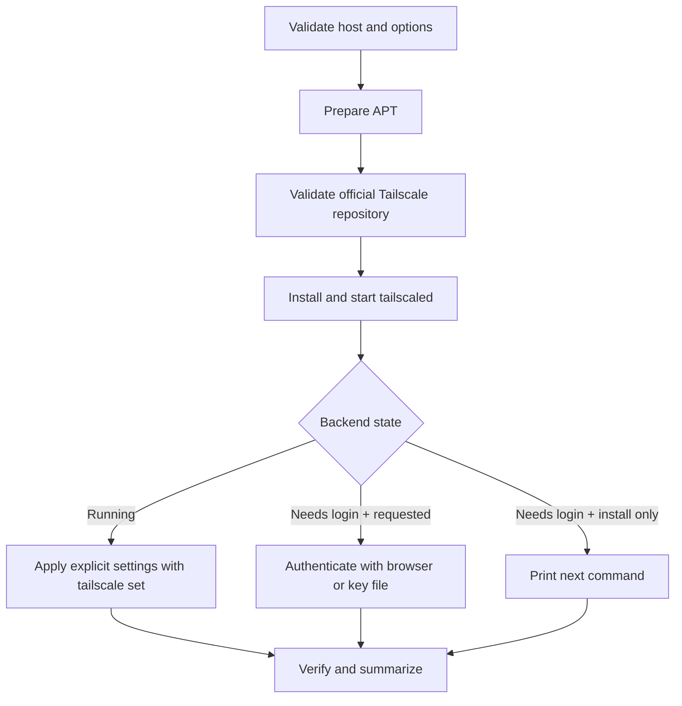

# Architecture

The project intentionally remains a single auditable Bash entry point. It uses
small functions with one responsibility rather than a framework or opaque
bootstrap layer.

## Trust boundaries

| Boundary | Control |
| --- | --- |
| Local invocation | Root check, strict Bash mode, validated options |
| Operating system | `/etc/os-release` must identify Ubuntu and a safe codename |
| Package source | HTTPS-only official URL and exact APT source comparison |
| Repository signing | Dedicated `signed-by` keyring and OpenPGP parsing |
| Authentication secret | Protected regular file and Tailscale `file:` input |
| Service state | `systemctl enable --now` followed by an active-state check |
| Tailnet policy | Left to Tailscale; the installer never edits policy |

## Why no automatic full upgrade?

Upgrading every package is outside the smallest privilege and change scope
needed to install Tailscale. It can introduce unrelated service restarts,
configuration prompts, kernel updates, or reboot requirements. The behavior is
available through `--upgrade-system` when an operator intentionally chooses it.

## Why no `curl | sh`?

The official installation script is a supported path. This project uses the
official manual APT instructions so reviewers can see the repository key,
source definition, installed package, and service actions directly.

## Testability

Pure validation functions are sourced by `tests/test.sh`. A dry-run integration
test supplies fixture paths through two internal `UTI_*` variables, allowing
platform checks without modifying the test host.
